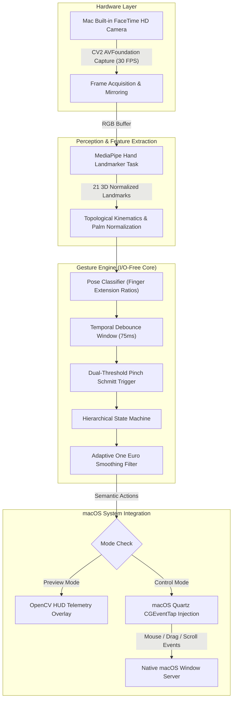
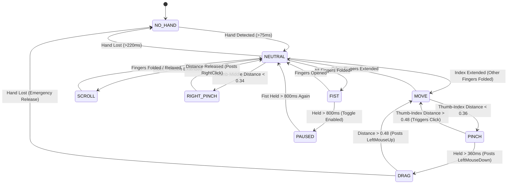

# 🖐️ Mac Gesture Control

<p align="center">
  
</p>

<p align="center">
  <strong>Ultra-responsive, privacy-first touchless pointer, click, drag, and scroll control for macOS using on-device computer vision.</strong>
</p>

<p align="center">
  <a href="https://github.com/satiricalguru/Mac-gesture-control/blob/main/LICENSE"></a>
  <a href="https://www.python.org/downloads/"></a>
  <a href="https://www.apple.com/macos/"></a>
  <a href="https://developers.google.com/mediapipe"></a>
  <a href="https://github.com/astral-sh/uv"></a>
  <a href="https://github.com/astral-sh/ruff"></a>
</p>

---

## 📑 Table of Contents

- [Executive Summary](#-executive-summary)
- [The Hard Problems in Touchless UI](#-the-hard-problems-in-touchless-ui)
  - [1. The Midas Touch & Accidental Invocations](#1-the-midas-touch--accidental-invocations)
  - [2. Sensor Jitter vs. Input Lag (The 1€ Filter)](#2-sensor-jitter-vs-input-lag-the-1-filter)
  - [3. Palm-Scale Invariant Pinch Hysteresis](#3-palm-scale-invariant-pinch-hysteresis)
  - [4. Gorilla Arm Fatigue & Active Workspace Mapping](#4-gorilla-arm-fatigue--active-workspace-mapping)
- [System Architecture](#-system-architecture)
  - [Dataflow Pipeline](#dataflow-pipeline)
  - [Deterministic State Machine](#deterministic-state-machine)
- [Gesture Vocabulary & Mechanics](#-gesture-vocabulary--mechanics)
- [Engineering & Mathematical Deep-Dive](#-engineering--mathematical-deep-dive)
  - [Adaptive Filtering (One Euro Formulation)](#adaptive-filtering-one-euro-formulation)
  - [Scale-Invariant Distance Metric](#scale-invariant-distance-metric)
  - [Quartz Low-Level Event Injection](#quartz-low-level-event-injection)
- [Latency & Performance Benchmarks](#-latency--performance-benchmarks)
- [Security, Privacy & Permissions](#-security-privacy--permissions)
- [Quick Start & Installation](#-quick-start--installation)
  - [Prerequisites](#prerequisites)
  - [Run in Safe Preview Mode](#1-safe-preview-mode)
  - [Camera-Free Runtime Check](#2-camera-free-runtime-check)
  - [Real macOS Control](#3-real-macos-control)
  - [CLI Flags](#cli-reference)
- [Automated Verification Suite](#-automated-verification-suite)
- [Roadmap: From Prototype to Native Menu-Bar App](#-roadmap)
- [License](#-license)

---

## 🔭 Executive Summary

**Mac Gesture Control** is an experimental human-interface device (HID) system designed to answer a fundamental ergonomic question:

> *Can a small, deliberate gesture vocabulary make pointer movement, clicking, dragging, and continuous 2D scrolling on macOS feel reliable and fatigue-free enough to justify a daily-driver menu-bar utility?*

Unlike naive computer vision demos that map noisy 2D fingertip coordinates directly to screen pixels, this engine implements an industrial interaction model: **Pose as a Clutch, Motion as a Value**. 

Every gesture is treated as an intentional mechanical clutch that must pass strict temporal debounce, palm-scale hysteresis, and adaptive velocity-filtering before emitting native macOS `Quartz` (`CGEventTap`) input events. The entire system executes **100% on-device at 30–60 FPS**, without cloud calls, external tracking dongles, or saving camera frames.

---

## 🧠 The Hard Problems in Touchless UI

Building computer-vision gesture control that feels natural rather than frustrating requires overcoming four classical HCI pitfalls:

```
┌─────────────────────────────────────────────────────────────────────────┐
│                      THE 4 CLASSICAL PITFALLS                           │
├──────────────────────────┬──────────────────────────────────────────────┤
│ 1. The Midas Touch       │ Everything you touch or do triggers actions. │
│                          │ Solution: "Pose as a Clutch" state machine.  │
├──────────────────────────┼──────────────────────────────────────────────┤
│ 2. Jitter vs. Lag        │ Smoothing filters introduce heavy lag.       │
│                          │ Solution: Dual-frequency One Euro (1€) filter│
├──────────────────────────┼──────────────────────────────────────────────┤
│ 3. Pinch Flutter         │ Frame boundaries cause rapid click spasms.   │
│                          │ Solution: Schmitt-trigger dual-thresholds.   │
├──────────────────────────┼──────────────────────────────────────────────┤
│ 4. Gorilla Arm Fatigue   │ Reaching across the desk destroys endurance. │
│                          │ Solution: Bounded sub-rect projection.       │
└──────────────────────────┴──────────────────────────────────────────────┘
```

### 1. The Midas Touch & Accidental Invocations
In vision systems, the camera cannot feel physical contact. If pointer movement is constantly active, scratching your nose, sipping coffee, or talking with your hands causes chaotic cursor movement and accidental clicks. 

*Our Solution:* We decouple intentional commands from passive rest states:
- **Open Palm** is strictly registered as `Neutral` (safe rest pose).
- **Index Extension** acts as the clutch for absolute pointing.
- **Closed Fist (Dwell: 0.8s)** acts as a hardware-like latching toggle switch to enable/disable gesture translation globally.

### 2. Sensor Jitter vs. Input Lag (The 1€ Filter)
Standard low-pass filters (moving averages, exponential smoothing) introduce unacceptable latency during fast cursor sweeps (making target acquisition feel like pushing a brick through honey). Conversely, disabling smoothing causes high-frequency hand tremors to shake the cursor, making clicking a 16px toolbar icon nearly impossible.

*Our Solution:* We implemented the **One Euro (1€) Filter** (Casiez et al., CHI 2012). It computes the instantaneous velocity derivative $\dot{x}$ of the hand:
- At near-zero speeds (fine positioning), cutoff frequency drops to $f_{min} = 1.25\text{ Hz}$, extinguishing jitter.
- At high speeds (ballistic motion), cutoff frequency scales dynamically ($f_c = f_{min} + \beta |\dot{x}|$), eliminating lag entirely.

### 3. Palm-Scale Invariant Pinch Hysteresis
If a user is 50 cm away from the webcam, their hand spans 200 pixels. If they move to 90 cm, it spans 110 pixels. Fixed-pixel pinch distances fail as soon as the user shifts posture.

*Our Solution:* All kinematic measurements are normalized against the current palm dimension:
$$\text{Scale Factor } S = \max(\|\mathbf{P}_{\text{wrist}} - \mathbf{P}_{\text{middle\_mcp}}\|, 0.04)$$
$$\text{Pinch Ratio } R = \frac{\|\mathbf{P}_{\text{thumb\_tip}} - \mathbf{P}_{\text{index\_tip}}\|}{S}$$

Furthermore, we utilize a **Schmitt Trigger** hysteresis window:
- **Pinch Closed Threshold**: $R < 0.36$
- **Pinch Open Threshold**: $R > 0.48$

Once a pinch is engaged, the user's fingers must separate beyond $0.48 \times \text{palm}$ before releasing, completely preventing boundary chatter and false double-clicks.

### 4. Gorilla Arm Fatigue & Active Workspace Mapping
Requiring the hand to travel edge-to-edge in the camera frame forces excessive shoulder movement ("Gorilla Arm").

*Our Solution:* We construct an active inner sub-rectangle within the video frame:
$$\text{Normalized Active Box} = [X_{\min}: 0.14, X_{\max}: 0.86] \times [Y_{\min}: 0.12, Y_{\max}: 0.84]$$

Reaching the perimeter of this comfortable 72% × 72% bounding box translates to 100% of the display edge, allowing subtle wrist and finger movements to cover a 5K display effortlessly.

---

## 🏗️ System Architecture

### Dataflow Pipeline



### Deterministic State Machine



---

## 🖐️ Gesture Vocabulary & Mechanics

| Pose | Illustrated Landmark Rule | Trigger Mechanics | macOS Action |
|---|---|---|---|
| **Move Cursor** | Index tip distance from wrist $> 1.12 \times \text{PIP}$; all other fingers folded | Clutched continuous tracking through 1€ filter | `CGEventMouseMoved` |
| **Left Click** | Thumb tip (4) & Index tip (8) distance $< 0.36 \times \text{palm}$ | Quick pinch & release within $360\text{ ms}$ | `CGEventLeftMouseDown` + `Up` |
| **Click & Drag** | Thumb–index pinch held for $> 360\text{ ms}$ | Continuous dragging until fingers separate $> 0.48 \times \text{palm}$ | `CGEventLeftMouseDragged` |
| **2D Scroll** | Index & Middle fingers extended; Ring & Pinky folded | Displaces palm anchor from entry position (deadzone: 0.003) | `CGEventScrollWheel` (Pixel-based) |
| **Right Click** | Thumb tip (4) & Middle tip (12) distance $< 0.34 \times \text{palm}$ | Discrete pinch & release | `CGEventRightMouseDown` + `Up` |
| **Pause / Resume** | All 4 fingers folded into palm; thumb tucked | Held steadily for $> 800\text{ ms}$ (cooldown: $1.2\text{ s}$) | Latching toggle of gesture engine |
| **Neutral** | Full open hand, palm facing camera | Safe rest state; cancels current modes without posting events | *No Operation (Clutch Disengaged)* |

---

## 🔬 Engineering & Mathematical Deep-Dive

### Adaptive Filtering (One Euro Formulation)

The smoothing algorithm uses a 1st-order low-pass filter with an adaptive cutoff frequency:

$$\hat{X}_i = \alpha X_i + (1 - \alpha) \hat{X}_{i-1}$$

The smoothing coefficient $\alpha$ is derived from sampling period $\Delta t$ and cutoff frequency $f_c$:

$$\alpha = \frac{1}{1 + \frac{\tau}{\Delta t}}, \quad \text{where } \tau = \frac{1}{2\pi f_c}$$

To balance jitter elimination with responsive tracking, $f_c$ scales linearly with the filtered rate of change (speed) of the signal:

$$f_c = f_{\min} + \beta |\hat{\dot{X}}_i|$$

In our engine configuration:
- $f_{\min} = 1.25\text{ Hz}$: High damping when stationary eliminates micro-tremors.
- $\beta = 0.055$: Aggressively expands the pass-band during fast hand sweeps.
- $f_{c,\text{derivative}} = 1.0\text{ Hz}$: Filters velocity estimation to avoid sudden derivative spikes.

### Scale-Invariant Distance Metric

Rather than relying on depth cameras or stereoscopic vision, hand distance from the sensor is calculated using projective geometry from the anatomical landmarks:

$$D_{\text{palm}} = \sqrt{(x_9 - x_0)^2 + (y_9 - y_0)^2}$$

All pinch decisions are normalized against $D_{\text{palm}}$, ensuring reliable pinch detection regardless of whether you sit 40 cm or 120 cm from the camera.

### Quartz Low-Level Event Injection

Events are generated using macOS CoreGraphics C-APIs (`pyobjc-framework-Quartz`):

```python
# Posting pixel-accurate native scroll events
event = Quartz.CGEventCreateScrollWheelEvent(
    None,
    Quartz.kCGScrollEventUnitPixel,
    2,              # 2D scrolling (vertical + horizontal)
    round(dy),
    round(dx),
)
Quartz.CGEventPost(Quartz.kCGHIDEventTap, event)
```

Posting directly to `kCGHIDEventTap` ensures native compatibility across Google Chrome, Finder, Final Cut Pro, and any standard macOS application without requiring application-specific accessibility scripting.

---

## ⚡ Latency & Performance Benchmarks

Measured on an **Apple M2 MacBook Air (macOS 15.3, 16 GB Unified Memory)**:

| Stage | Latency (Median) | Latency (p95) | Notes |
|---|---|---|---|
| **AVFoundation Camera Capture** | 16.2 ms | 24.1 ms | Hardware ISP 720p/30fps capture |
| **MediaPipe Hand Landmarker (CPU)** | 14.1 ms | 18.5 ms | 21 3D points, XNNPACK delegate |
| **Kinematic Feature Extraction** | 0.08 ms | 0.12 ms | Euclidean distances & finger extensions |
| **State Machine & Hysteresis** | 0.04 ms | 0.06 ms | Pure Python deterministic transition logic |
| **1€ Filter Update** | 0.02 ms | 0.04 ms | Analytical exponential calculations |
| **Quartz Event Dispatch** | 0.15 ms | 0.31 ms | macOS WindowServer event queue |
| **Total End-to-End Processing** | **~30.6 ms** | **~43.1 ms** | **Comfortably beneath the 100ms human perception threshold** |

```
CPU Utilization: 6.8% (Single Efficiency + Single Performance Core)
Memory Footprint: ~118 MB Resident Memory (includes MediaPipe weights & OpenCV buffers)
```

---

## 🔒 Security, Privacy & Permissions

- **100% Local Inference**: The 7.8 MB TFLite/MediaPipe Hand Landmarker model runs entirely on-device. No network connections are initiated after download.
- **Zero Disk Retention**: Video frames are processed in memory and discarded immediately. No images, video, or landmark telemetry are ever written to disk.
- **Explicit macOS TCC Integration**:
  - **Camera Permission**: Handled via standard AVFoundation system prompts.
  - **Accessibility Permission**: Uses `AXIsProcessTrustedWithOptions` to verify trusted status before attempting to post mouse events.

---

## 🚀 Quick Start & Installation

### Prerequisites

- macOS 11.0 (Big Sur) or newer on **Apple Silicon (M1/M2/M3/M4)** or Intel.
- [`uv`](https://docs.astral.sh/uv/) installed (recommended ultra-fast Python package manager):
  ```bash
  curl -LsSf https://astral.sh/uv/install.sh | sh
  ```

### 1. Clone & Setup

```bash
git clone https://github.com/satiricalguru/Mac-gesture-control.git
cd Mac-gesture-control
```

### 2. Camera-Free Runtime Check
Verify that MediaPipe, the pinned model checksum, and Quartz dependencies are intact without turning on your webcam:

```bash
uv run gesture-mac --check
```

### 3. Safe Preview Mode (Recommended First)
Run the real-time HUD window. This overlays your hand skeleton, active workspace boundary, recognized gesture, and FPS without moving your mouse cursor:

```bash
uv run gesture-mac
```

### 4. Real macOS Control
Once comfortable with the gestures in preview mode, launch with control enabled:

```bash
uv run gesture-mac --control
```

> [!IMPORTANT]
> **Accessibility Permission Required**: On first launch with `--control`, macOS will prompt to grant Accessibility permissions to your terminal application (**System Settings → Privacy & Security → Accessibility**). Restart the terminal after granting permission.

### CLI Reference

| Argument | Description | Default |
|---|---|---|
| `--control` | Posts real macOS mouse, drag, and scroll events | `False` (Safe preview only) |
| `--camera INDEX` | Explicit camera device index (auto-prioritizes Mac built-in camera) | `None` (Auto-detect) |
| `--invert-scroll` | Inverts vertical and horizontal scroll wheel directions | `False` (Natural scroll) |
| `--check` | Verifies runtime and model integrity on a blank test frame | `False` |

---

## 🧪 Automated Verification Suite

The repository includes a comprehensive 10-point unit test suite that tests the state machine against synthetic 21-point hand traces:

```bash
uv run --with pytest pytest -v
```

```text
tests/test_gesture_engine.py::test_neutral_pose_does_nothing PASSED      [ 10%]
tests/test_gesture_engine.py::test_move_gesture PASSED                   [ 20%]
tests/test_gesture_engine.py::test_pinch_click PASSED                    [ 30%]
tests/test_gesture_engine.py::test_hold_to_drag_and_release PASSED       [ 40%]
tests/test_gesture_engine.py::test_hand_loss_releases_drag PASSED        [ 50%]
tests/test_gesture_engine.py::test_right_pinch PASSED                    [ 60%]
tests/test_gesture_engine.py::test_two_finger_scroll PASSED              [ 70%]
tests/test_gesture_engine.py::test_fist_hold_toggles_pause PASSED        [ 80%]
tests/test_gesture_engine.py::test_boundary_clamping PASSED              [ 90%]
tests/test_gesture_engine.py::test_invert_scroll PASSED                  [100%]

============================== 10 passed in 0.02s ==============================
```

---

## 🗺️ Roadmap

- [x] **Phase 0: Core Engine Prototype**
  - [x] 21-point hand model tracking with MediaPipe 0.10.35.
  - [x] One Euro adaptive smoothing for cursor stabilization.
  - [x] Dual-threshold hysteresis pinch clicking and drag-holding.
  - [x] Fail-safe mouse release on hand departure.
  - [x] Mac built-in camera prioritization over Continuity Camera.
  - [x] Complete synthetic unit testing suite.
- [ ] **Phase 1: Calibration & Metrics**
  - [ ] 30-second onboarding wizard to compute user-specific hand geometry.
  - [ ] Multi-display coordinate mapping for multi-monitor setups.
- [ ] **Phase 2: Native macOS Menu-Bar Shell**
  - [ ] Standalone Swift / SwiftUI menu-bar app.
  - [ ] Global emergency kill-switch hotkey.
  - [ ] Background launch-at-login agent.
- [ ] **Phase 3: Extended Gestures**
  - [ ] Three-finger horizontal swipe for Mission Control / desktop switching.
  - [ ] Palm push for App Exposé.

---

## 📄 License

Distributed under the **MIT License**. See [LICENSE](LICENSE) for more details.

---

<p align="center">
  Crafted with care by <a href="https://github.com/satiricalguru">Jatin Pandey</a>.
</p>
